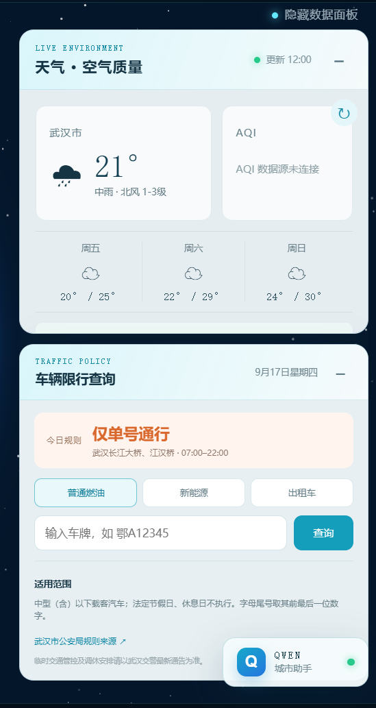
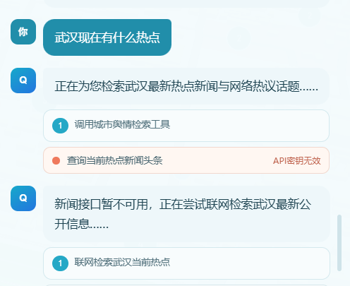
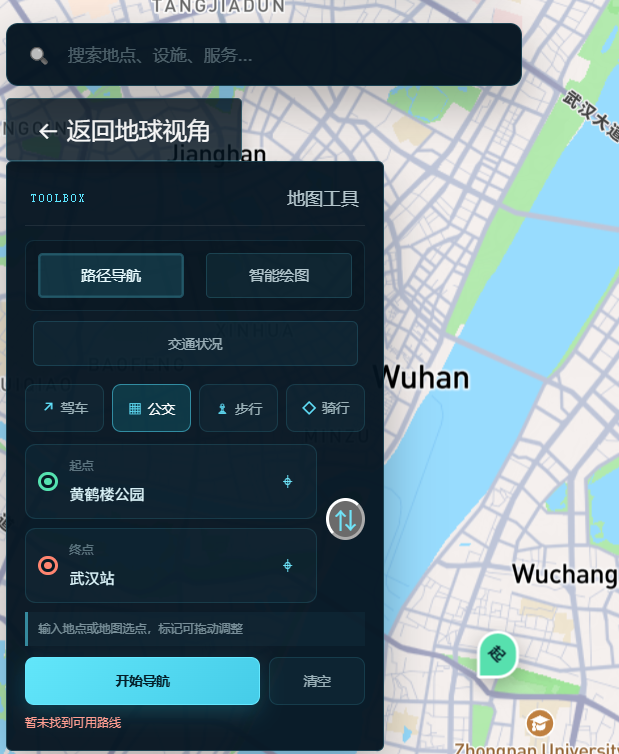
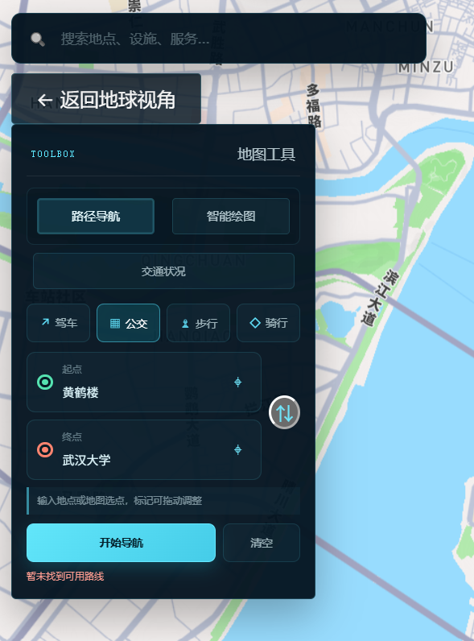
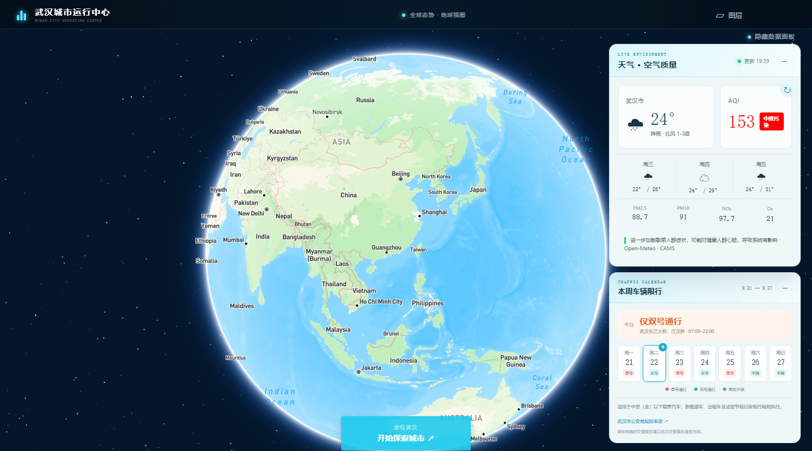

# 武汉智慧城市数字孪生与城市智能体平台

一个由 Qwen 城市智能体驱动的武汉智慧城市 Web 数字孪生项目。用户可以直接用自然语言控制地图、定位城市地点、切换图层与三维视角、显示停车场或充电站，并规划驾车、公交地铁、步行和骑行路线；平台同时提供全球地球视角、武汉三维城市、智能绘图、天气和空气质量等城市运行能力。

> 核心特色是“AI 对话即地图操作”：Qwen 只生成经过白名单约束的结构化动作，前端逐项执行并反馈结果，避免模型直接运行任意代码。本项目适合智慧城市课程设计、城市智能体原型、数字孪生大屏和 WebGIS 功能验证。

## 项目截图

### Qwen 城市智能体：环境理解与工具编排

<table>
  <tr>
    <td width="50%"></td>
    <td width="50%"></td>
  </tr>
  <tr>
    <td align="center">天气、AQI、限行等城市上下文</td>
    <td align="center">联网热点检索与工具链容错</td>
  </tr>
  <tr>
    <td colspan="2" align="center"></td>
  </tr>
  <tr>
    <td colspan="2" align="center">多步任务编排的防循环保护</td>
  </tr>
</table>

> “联网热点检索”截图记录了旧新闻接口失效时智能体自动转入公开网络检索的容错过程；当前版本已移除失效接口，热点问题会直接使用 Qwen 联网搜索。

### 城市智能体的地图工具执行结果

<table>
  <tr>
    <td width="50%"></td>
    <td width="50%"></td>
  </tr>
  <tr>
    <td align="center">自然语言触发驾车路径与逐路段导航</td>
    <td align="center">自然语言触发公交、地铁公共交通规划</td>
  </tr>
</table>

### 城市态势总览



> 页面数据会随 API 配置、实时天气、空气质量和地图服务状态变化；截图用于展示主要交互形态。

## 主要功能

### 地球与三维城市

- 全球地球视角与武汉城市视角切换。
- 从地球视角飞入武汉，并定位到黄鹤楼附近。
- 支持标准城市、卫星、街道、户外、暗夜、浅色、导航日间与导航夜间等底图。
- 可开启或关闭三维建筑、动态光照和城市天际线视角。
- 提供武汉总览、垂直俯视和城市天际线三种视角预设。

### 路径规划与公共交通

- 支持驾车、公共交通、步行和骑行规划。
- 起点和终点支持地点联想、地图选点、交换位置与拖动调整。
- 公共交通同时覆盖公交与地铁换乘方案。
- 展示路线距离、预计耗时、换乘详情、步行距离和费用等信息。
- 高德 GCJ-02 路线坐标会转换为 WGS84 后绘制到 Mapbox 地图。

### 停车场与充电站

- 基于高德 POI 服务加载武汉停车场和充电站。
- 根据当前地图视野分页加载全部可获取的设施数据。
- 缩小时以聚合数量展示，放大后自动展开为单个设施。
- 点击设施可查看名称、地址、电话和分类。
- 针对高德免费 Key 的 QPS 限制实现了请求排队与节流。

> 当前接入的是 POI 位置与基础属性，不包含实时空余车位、停车价格、充电枪可用状态或充电功率。实时状态需要停车运营商、充电平台或政府数据接口。

### 智能地图绘图

- 绘制点、路径、区域、矩形和圆形。
- 圆形支持输入并修改半径。
- 支持选择、编辑、删除、撤销和重做。
- 显示点位经纬度、路径长度、区域面积和圆形半径。

### 城市环境与交通政策

- 天气实况与未来天气预报。
- AQI、PM2.5、PM10、二氧化氮、臭氧等空气质量指标。
- 车辆单双号通行日历。
- 交通状态和武汉行政区可视化组件。
- 数据面板区分实时数据、第三方数据和演示数据。

### Qwen 城市智能体

- 使用阿里云 DashScope OpenAI 兼容接口调用通义千问。
- 内置长时用户画像，可记住家、公司/学校、常去地点、默认出行方式及天气、空气、限行关注偏好。
- 支持“回家”“去公司”“老样子”等记忆别名，最近成功操作会作为后续决策上下文。
- 对话、用户画像和近期操作默认保存在浏览器 `localStorage`，刷新后仍可恢复；配置 MCP 记忆服务后可由用户主动开启跨设备同步。
- 把复杂目标拆成可见步骤，每轮最多三次动态决策：执行工具、读取真实结果，再决定下一步。
- 支持先搜索地点、再把搜索结果作为驾车经停点的多步任务，例如“从家去机场，路上顺便加油”。
- 能联合调用天气、AQI、路况和限行数据，并根据用户偏好给出融合决策，不再只做单项查询。
- 提供按需触发的城市联网搜索，可检索武汉最新新闻、政务通报、交通突发和被搜索引擎收录的社交媒体公开页，并展示可点击的原始来源。
- 联网结果会明确标注“公开网络情报”，不会冒充微博、小红书等平台的官方全量实时数据。
- 将当前城市、地图中心、缩放级别、视角、路线、设施状态和用户记忆作为受控上下文提供给模型。
- 支持用自然语言定位地点、切换底图与三维建筑、切换视角和打开地图工具。
- 可以直接规划驾车、公交地铁、步行和骑行路线，也可以显示停车场或充电站。
- 模型只能返回白名单内的结构化地图动作，前端逐项执行并展示成功或失败状态，不执行任意代码。
- 仍可回答城市服务、地图使用与城市治理相关问题；缺少实时数据时会明确说明。
- API Key 只由 Vite 服务端代理读取，不发送到浏览器。
- 支持配置模型、API 地址以及联网搜索开关。

### MCP 与外部城市服务

- 内置一个服务端 MCP Streamable HTTP 网关，前端不直接接触 MCP Token。
- 通过白名单暴露实时路况、公交实时到站、停车位、充电枪、政务搜索和云端记忆工具。
- 连接器未配置时，工具不会暴露给模型，界面会明确显示“MCP 待配置”，不会伪造实时数据。
- 运营商或政府数据源只需在 MCP 服务端实现同名工具，无需把私有密钥或厂商 SDK 写进前端。

## 技术栈

| 分类 | 技术 |
| --- | --- |
| 前端框架 | Vue 3、Vue Router、Vite |
| 地图渲染 | Mapbox GL JS |
| 空间计算 | Turf.js |
| 地图绘图 | Mapbox GL Draw、AntV L7 Draw |
| UI | Element Plus、自定义响应式组件 |
| 地点与路线 | 高德 Web Service |
| 天气与空气质量 | 高德天气、Open-Meteo |
| AI 助手 | 阿里云 DashScope / Qwen |
| 演示数据服务 | JSON Server、Mock.js |

## 目录结构

```text
.
├─ mock/                       # 武汉行政区及演示交通数据
├─ public/                     # 公共静态资源
├─ src/
│  ├─ api/                    # 前端请求与武汉行政区接口
│  ├─ components/             # 地图、导航、环境、绘图和 AI 组件
│  ├─ pages/                  # 欢迎页与平台主页面
│  ├─ router/                 # Vue Router 配置
│  └─ utils/                  # 高德、城市数据、长时记忆与 MCP 连接器
├─ .env.example               # 环境变量模板，不包含真实密钥
├─ vite.config.js             # Vite、代码分包与 Qwen 服务端代理
└─ package.json
```

## 环境要求

- Node.js 18 或更高版本，建议使用当前 LTS。
- pnpm 8 或更高版本。
- Mapbox Access Token。
- 高德 Web 服务 Key。
- 可选：阿里云 DashScope API Key，用于 Qwen 城市助手。

## 本地运行

### 1. 克隆项目

```bash
git clone https://github.com/Xqqqskye/wuhan-smart-city-digital-twin.git
cd wuhan-smart-city-digital-twin
```

### 2. 安装依赖

```bash
pnpm install
```

### 3. 配置环境变量

复制 `.env.example` 为 `.env.local`：

```bash
cp .env.example .env.local
```

Windows PowerShell：

```powershell
Copy-Item .env.example .env.local
```

填写本地密钥：

```dotenv
VITE_MAPBOX_TOKEN=your_mapbox_public_token
VITE_AMAP_KEY=your_amap_web_service_key

# 以下变量只由本地 Vite 服务端代理读取
DASHSCOPE_API_KEY=your_dashscope_api_key
QWEN_API_BASE=https://dashscope.aliyuncs.com/compatible-mode/v1
QWEN_MODEL=qwen-plus
QWEN_ENABLE_SEARCH=false
QWEN_CITY_SEARCH_ENABLED=true
QWEN_SEARCH_MODEL=qwen-plus
QWEN_SEARCH_STRATEGY=turbo
QWEN_CITY_SEARCH_SITES=wuhan.gov.cn,cjn.cn,weibo.com,hubei.gov.cn
DASHSCOPE_NATIVE_API_BASE=https://dashscope.aliyuncs.com/api/v1

# 可选：MCP Streamable HTTP 服务，用于实时到站/车位/充电枪/政务与跨设备记忆
CITY_MCP_SERVER_URL=https://your-mcp-server.example.com/mcp
CITY_MCP_AUTH_TOKEN=your_server_side_token
CITY_MCP_ALLOWED_TOOLS=realtime_traffic,transit_arrival,parking_availability,charging_availability,government_service_search,agent_memory_get,agent_memory_save
```

### 4. 启动开发服务

```bash
pnpm dev
```

默认访问地址以终端输出为准，例如：

```text
http://127.0.0.1:5173/
```

### 5. 可选：启动演示数据服务

```bash
pnpm mock
```

或同时启动模拟接口与交通数据更新脚本：

```bash
pnpm mock:all
```

## 构建与预览

```bash
pnpm build
pnpm preview
```

生产文件生成在 `dist/` 目录中。`dist/` 已加入 `.gitignore`，不会提交到源码仓库。

## 部署说明

纯地图页面可以部署到 GitHub Pages、Vercel、Netlify 或任意静态托管服务。需要注意：

- Qwen 助手依赖 `vite.config.js` 中的服务端代理，纯静态 GitHub Pages 无法运行该代理。
- 完整部署建议将 Qwen 代理迁移到 Serverless Function、Node.js 服务或云函数。
- `VITE_` 前缀变量会进入浏览器构建产物，只能放置允许公开到前端的 Token。
- DashScope API Key 不得添加 `VITE_` 前缀，也不得写入源码或提交到 Git。
- 建议为 Mapbox 和高德 Key 配置域名白名单、配额限制与监控告警。

## 数据来源与限制

| 数据 | 来源 | 说明 |
| --- | --- | --- |
| 底图与三维建筑 | Mapbox | 需要 Mapbox Token |
| POI、地点搜索、路线规划、天气 | 高德开放平台 | 受 Key 配额、QPS 与服务协议限制 |
| 空气质量 | Open-Meteo | 模型与预报数据，不应冒充官方站点实测 |
| 行政区和交通示例 | 项目 `mock/` 数据 | 用于演示，不代表实时城市运行状态 |
| Qwen 回复 | 阿里云 DashScope | AI 输出仅供辅助决策，应核验关键事实 |
| 城市联网情报 | Qwen 联网搜索 | 返回公开网页来源；不代表社交平台全量数据，并可能存在索引延迟 |
| 用户画像与对话 | 浏览器 localStorage / 可选 MCP | 本地模式不跨设备；云同步由用户手动开启 |
| 外部城市工具 | 可选 MCP 服务 | 实时性、授权与可用范围取决于接入的数据提供方 |

## 安全说明

- `.env`、`.env.*` 和 `*.local` 默认不提交，只有 `.env.example` 可以进入仓库。
- 家、公司、常去地点和最近对话默认仅保存在当前浏览器；发起 AI 对话时，必要的画像与对话上下文会发送给配置的 Qwen 服务。
- 跨设备同步默认关闭，只有用户在画像面板中主动开启后，才会通过服务端 MCP 连接器传输记忆数据。
- 不要在 Issue、提交记录或前端代码中粘贴真实 API Key。
- 如果密钥曾经公开，请立即在对应控制台轮换并撤销旧密钥。
- 生产环境应将需要保密的第三方调用放到后端，并增加请求校验、限流和日志脱敏。

## 常用命令

| 命令 | 用途 |
| --- | --- |
| `pnpm dev` | 启动 Vite 开发服务器 |
| `pnpm build` | 生成生产构建 |
| `pnpm preview` | 本地预览生产构建 |
| `pnpm mock` | 启动 JSON Server 演示接口 |
| `pnpm update-traffic` | 更新演示交通数据 |
| `pnpm mock:all` | 同时运行模拟接口和交通更新脚本 |

## 后续规划

- 接入停车场实时余位与充电枪状态。
- 增加沿路线停车/充电推荐和距离排序。
- 接入公共交通实时到站信息。
- 完善城市事件中心、告警处置和应急预案。
- 增加沿路线设施智能排序、任务撤销与长任务断点恢复。
- 增加单元测试、端到端测试和自动化部署流程。

## 许可证

仓库目前未声明开源许可证。在添加许可证之前，源码的复制、修改与分发仍受默认版权规则约束。
